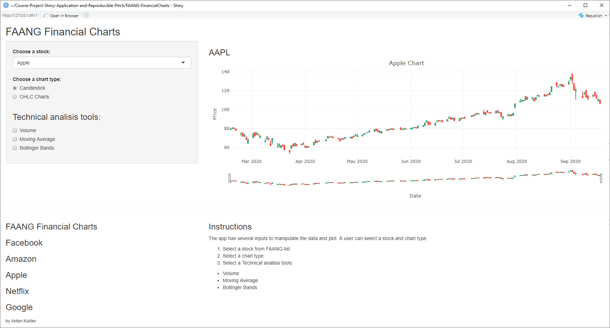

FAANG Financial charts
========================================================
author: Anton Kuklev
date: 
autosize: true

Overview
========================================================

This presentation was prepared for the **Course Project: Shiny Application and Reproducible Pitch**

The shiny app developed for this assignment is avalilable: https://kuaniv.shinyapps.io/faang-financialcharts/

The source codes of ui.R and server.R and also R Presentation are available on the GitHub repo: https://github.com/kuaniv/Course-Project-Shiny-Application-and-Reproducible-Pitch/

'FAANG' is an acronym that refers to the stocks of five prominent American technology companies: Facebook (FB), Amazon (AMZN), Apple (AAPL), Netflix (NFLX) and Alphabet (GOOG). The term was coined by Jim Cramer, the television host of CNBC's Mad Money, in 2013, who praised these companies for being "totally dominant in their markets."

Packages
========================================================

- Market data getting from yahoo.com using a package `quantmod`.  
- Financial charts ploting using a package `plotly`.  
- Web apps build with package `shiny`

How it works
========================================================

The app has several inputs to manipulate the data and plot. A user can select a stock and chart type. The user also could select some technical analisis tools.

* Select a stock from FAANG-list
* Select a chart type
* Select a Technical analisis tools:
  + Volume
  + Moving Average
  + Bollinger Bands

How it looks
========================================================

